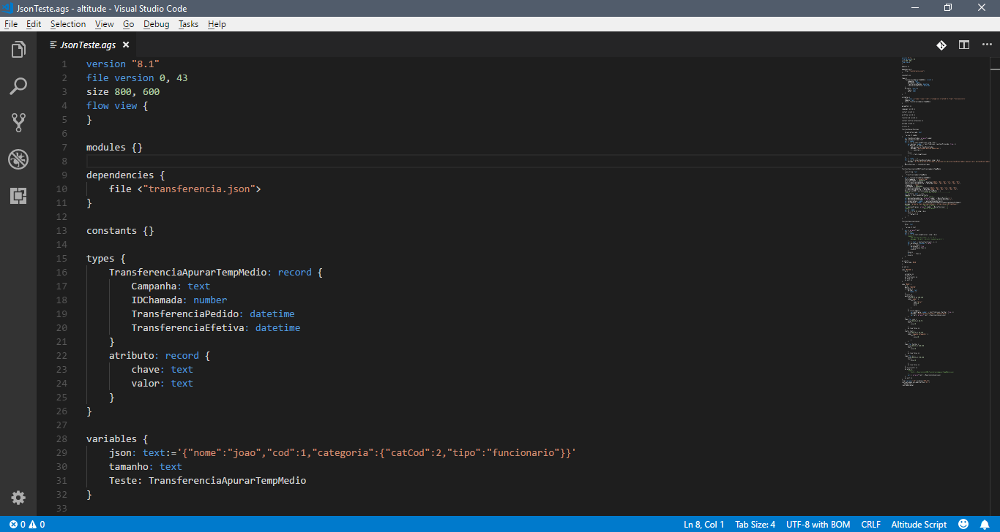

# altitude-script-language README

This is the README for "altitude-script-language" extension suport for vscode, using git flow for project management, i'm in early development and my first extension for vscode.

## Repository

https://github.com/ucavalcante/altitude-script-language.git

## Features

## Requirements

Prior knowledge of the ASL programming language because it does not yet have the Intelisense feature.

## Release Notes

Users appreciate release notes as you update your extension.

### 0.0.1

Initial release of for basic colorization

-----------------------------------------------------------------------------------------------------------

## Working with Markdown

**Note:** You can author your README using Visual Studio Code.  Here are some useful editor keyboard shortcuts:

* Split the editor (`Cmd+\` on macOS or `Ctrl+\` on Windows and Linux)
* Toggle preview (`Shift+CMD+V` on macOS or `Shift+Ctrl+V` on Windows and Linux)
* Press `Ctrl+Space` (Windows, Linux) or `Cmd+Space` (macOS) to see a list of Markdown snippets

### For more information

* [Visual Studio Code's Markdown Support](http://code.visualstudio.com/docs/languages/markdown)
* [Markdown Syntax Reference](https://help.github.com/articles/markdown-basics/)

**Enjoy!**
